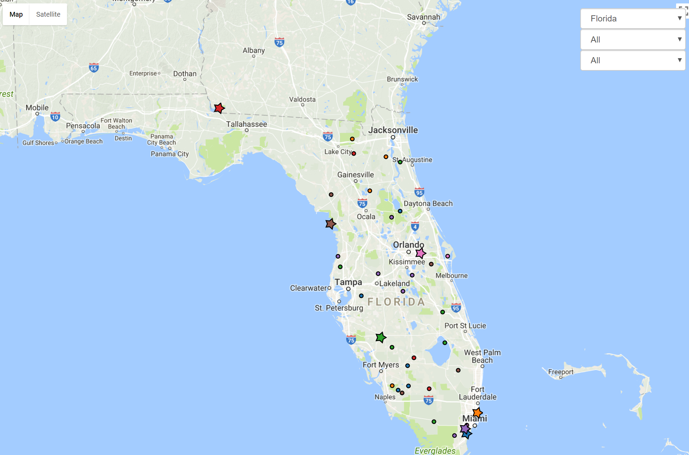
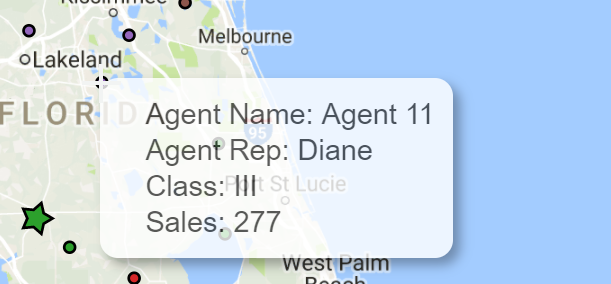
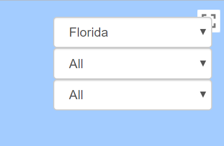

# Interactive Google Map with Overlay

[Link](https://htmlpreview.github.io/?https://github.com/jjburke3/interactive_map/blob/master/agent_map.html)

This map was created to show locations of agents and agent marketing reps.  It was been changed from its original version, which pulled from a SQL database, to include randomized data contained in csv files.  The circles indicate agents, and stars indicate the home location of marketing reps.

Scrolling over a point brings up additional data

Drop downs in the top right corner allow you to filter the displayed agents/reps

## Built With

* [d3.js](https://d3js.org/) - Javascript Library for Manipulating Data
* [Bootstrap](https://getbootstrap.com/) - Frontend Webframe Work
* [Google Maps API](https://developers.google.com/maps/) - API for drawing google maps

